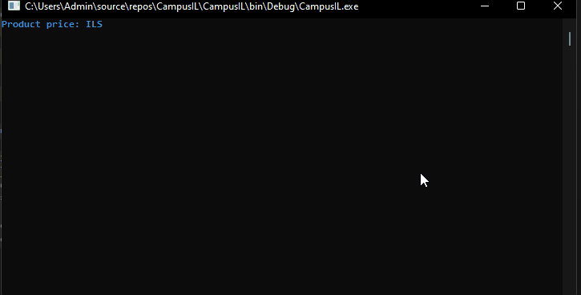

# Tax Calculator

For every product you buy in the state of israel, there is a tax included.
The tax can increase if the goverment decide it should. 
as for today, the tax rate standing at 17%, and to calculate the price we should convert it to decimal. so 17% out of 100% is like 0.17 from 1.0.
Finally, a string.fromat is used to enter {0} as the final price after a Math.Round method is called to round the number to 2 numbers after the decimal.
for exmaple, instead of 12.6123 it will round the output to the console as for 12.61
