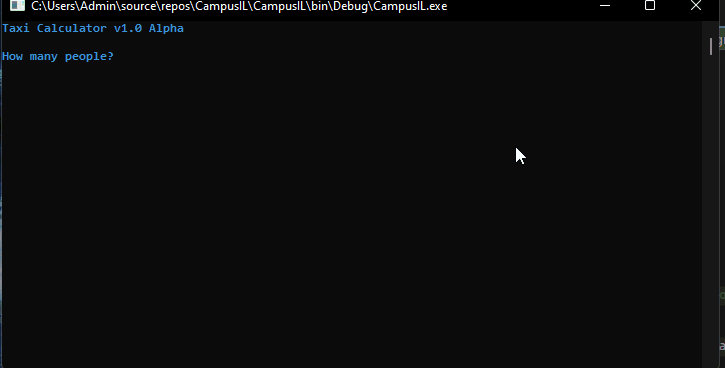

# Taxi Calculator
</img>

Campus IL - Introduction to Computer Science in C# 
Excerisce 3 # - Taxi trip calculator

We will have 4 const double variables to store the prices of km, starting fee, extra people fee, suitcases.
then, we will create 3 variables to store the user input in order to calculate the final.

we will print to the user the number of km, the number of people and the number of suitcases in order for him to see that the input went correctly to the calculation and he hadn't mistake.
