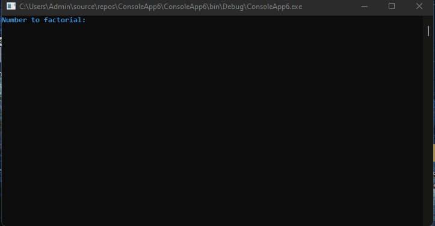

# C# Recrusion

 
Recrusion is a function that call itself. In order to make a recrusion we need a "exit" code. 
 
The exit code will be if (number == 0), but the return will be diffrent between calculations.
 
If we intend to divide or multiple - the return will be 1, because the final number * or / by 1 will always be the final number.
 
For example - 5*1 = 5 and 5/1 = 5 .
 
If we using adding or subtracting, the return will need to be 0, because 5+1 = 6 and 5-1 = 4, while 5+0 = 5 and 5-0 = 5.
 
Recrusion is very powerfull and saving time. instead of using for loop to increment or decrement a number, we just create a function that call itself.
